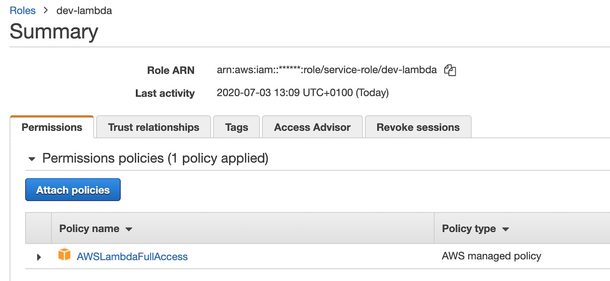

## Install

    $ npm install -g serverless
    $ sls config credentials --profile serverless --provider aws --k "AWS_ACCESS_KEY_ID" --s "AWS_SECRET_ACCESS_KEY"
    $ cat ~/.aws/credentials
    $ export AWS_PROFILE=serverless

## Preparation

1. create AWS Role for lambda function

2. create AWS S3 bucket

    $ aws s3 mb s3://sdemo-s3 --profile=serverless
    $ aws s3 ls --profile=serverless

## Deploy

Lambda 1: Image resize

    $ cd s3-listener-lambda
    $ sls deploy \
        --profile serverless \
        --stage dev \
        --arn-pillow-layer arn:aws:lambda:eu-west-1:789525204837:layer:pillow:7 \
        --aws-role arn:aws:iam::789525204837:role/service-role/dev-lambda \
        --aws-region eu-west-1 \
        --s3-bucket sdemo-s3

Lambda 2: REST API

    $ cd rest-api-lambda
    $ sls deploy \
        --profile serverless \
        --stage dev \
        --aws-role arn:aws:iam::789525204837:role/service-role/dev-lambda \
        --s3-bucket sdemo-s3

### Development stage:

1. REST API:

    $ cd rest-api-lambda

Endpoints:

    GET - https://*****.execute-api.eu-west-1.amazonaws.com/dev/item
    GET - https://*****.execute-api.eu-west-1.amazonaws.com/dev/item/{id}

## Invoke

    sls invoke -f list --profile serverless

## Debug

Add image to s3 bucket:

    $ aws s3 cp images/r-and-morty-01.jpg s3://sdemo-s3/images/ --profile serverless

Stream logs:

for S3 listener and images resize:

    $ cd s3-listener-lambda/
    $ sls logs -f handle-api -t --stage dev --profile serverless

for REST API:

    $ cd rest-api-lambda/
    $ sls logs -f list -t --stage dev --profile serverless

Invoke function:

    $ sls invoke -f handle-api --stage dev --profile serverless \
        -d '{"Records":[{"s3": { "bucket": {"name":"sdemo-s3"}, "object":{ "key": "images/r-and-morty-01.jpg"}  }}]}'

# Useful AWS CLI commands:

Display all s3 buckets:

    $ aws s3 ls --profile=serverless

Show all images in bucket:

    $ aws s3 ls s3://sdemo-s3/images/ --profile serverless
