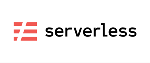

## Install

    $ npm install -g serverless
    $ sls config credentials --profile serverless --provider aws --k "AWS_ACCESS_KEY_ID" --s "AWS_SECRET_ACCESS_KEY"
    $ cat ~/.aws/credentials
    $ export AWS_PROFILE=serverless

# Preparation

1. create AWS Role for lambda function

[

## Deploy

Image resize

    $ cd s3-listener-lambda
    $ sls deploy \
        --profile serverless \
        --stage dev \
        --s3-bucket-images images

REST API

    $ cd rest-api-lambda
    $ sls deploy \
        --profile serverless \
        --stage dev \
        --s3-bucket-storage sdemo-s3

### Development stage:

1. REST API:

    $ cd rest-api-lambda

Endpoints:

    GET - https://*****.execute-api.eu-west-1.amazonaws.com/dev/item
    GET - https://*****.execute-api.eu-west-1.amazonaws.com/dev/item/{id}

2. Image resize service:

    $ aws s3 mb s3://images --profile=serverless
    $ aws s3 mb s3://images --profile=serverless

## Invoke

    sls invoke -f list

## Debug

    sls logs -f list -t

# Useful AWS CLI commands:

Display all s3 buckets:

    $ aws s3 ls --profile=serverless
